## JMeter results
### `/all-student-name`

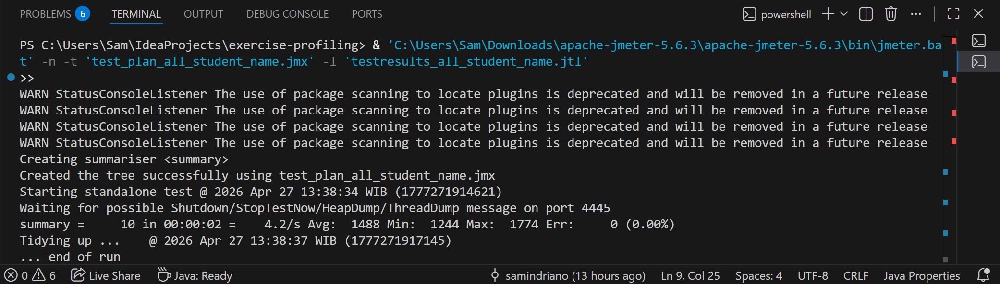
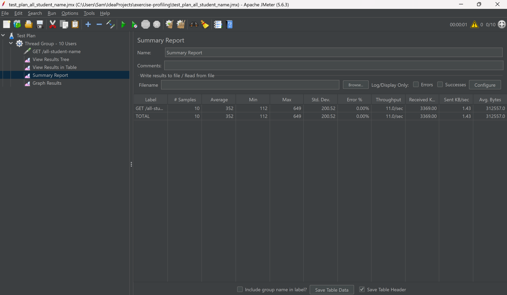
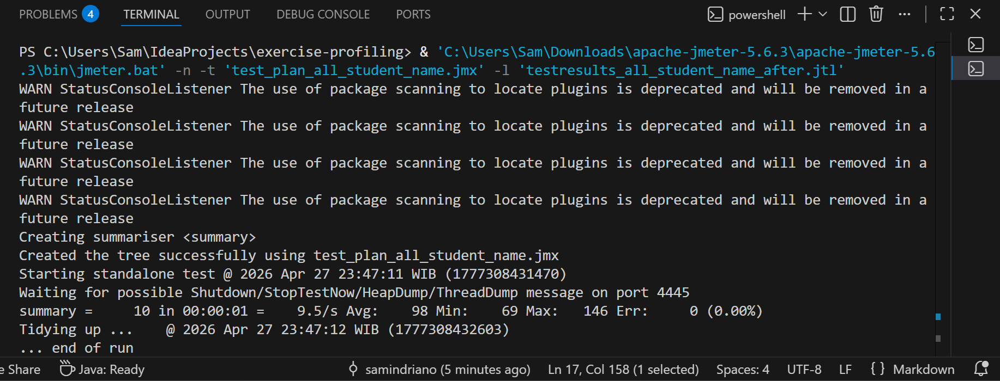

### `/highest-gpa`
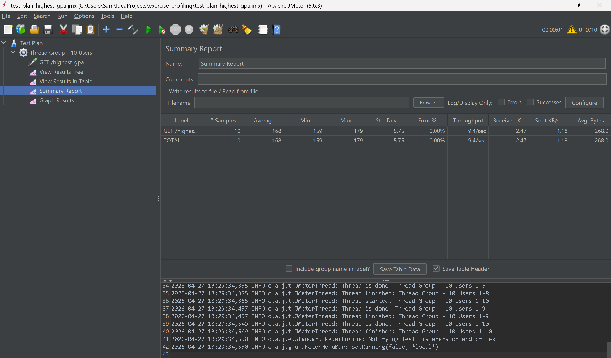

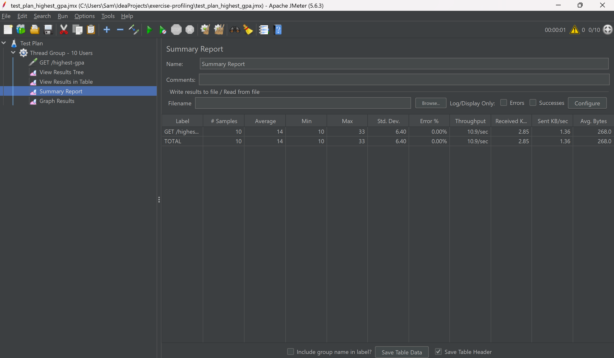
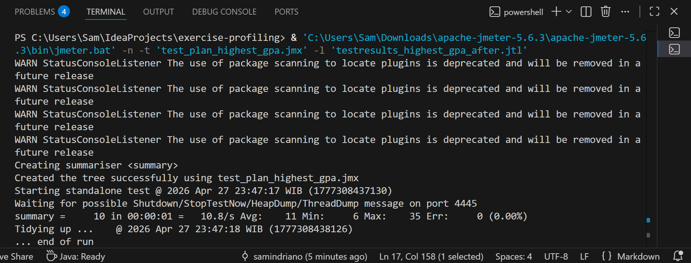

## Optimization results
### `/all-student`
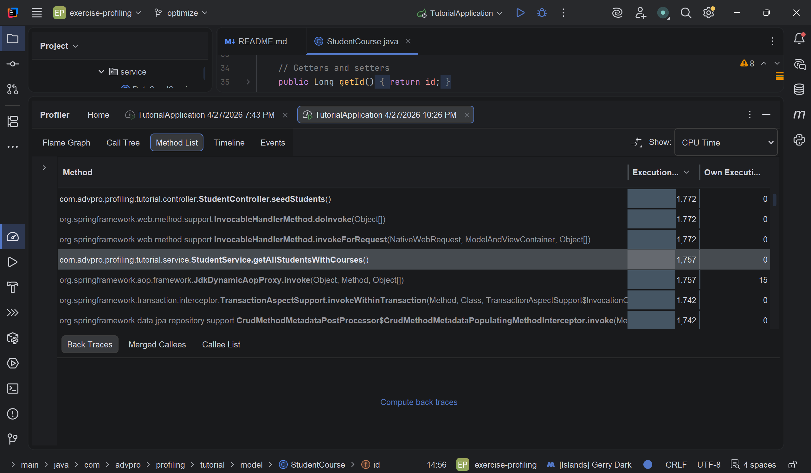
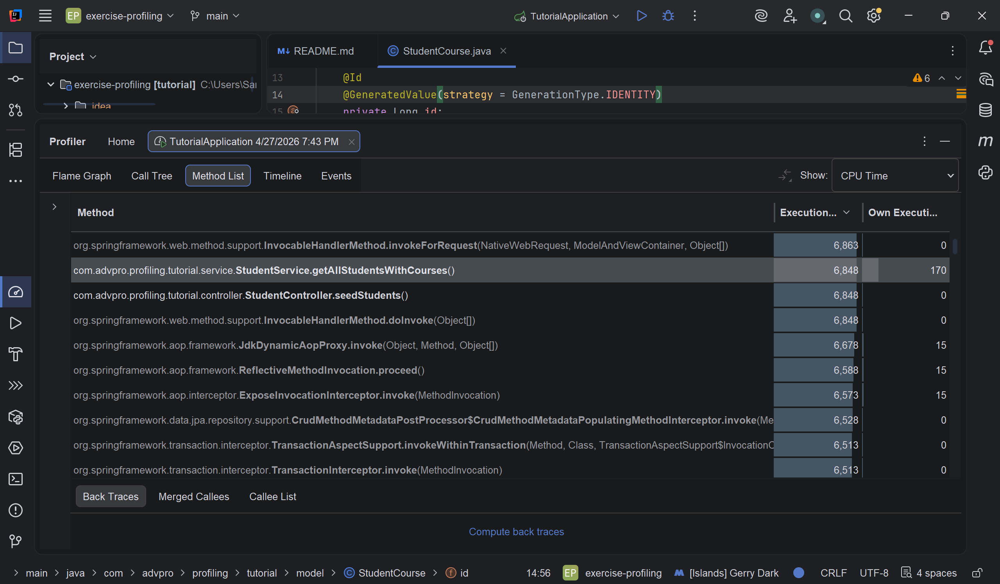

### `/all-student-name`
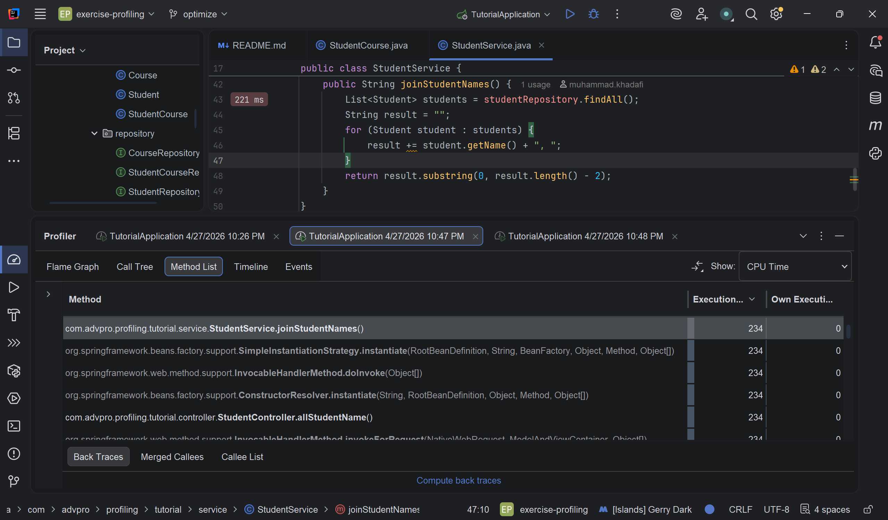
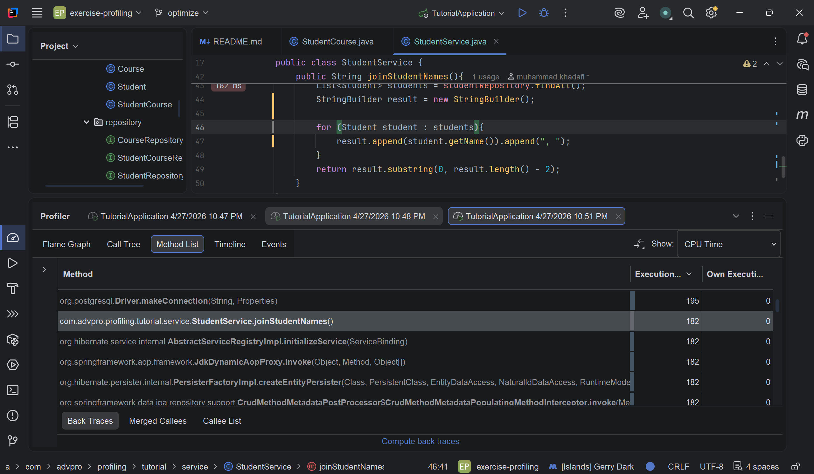

### `/highest-gpa`
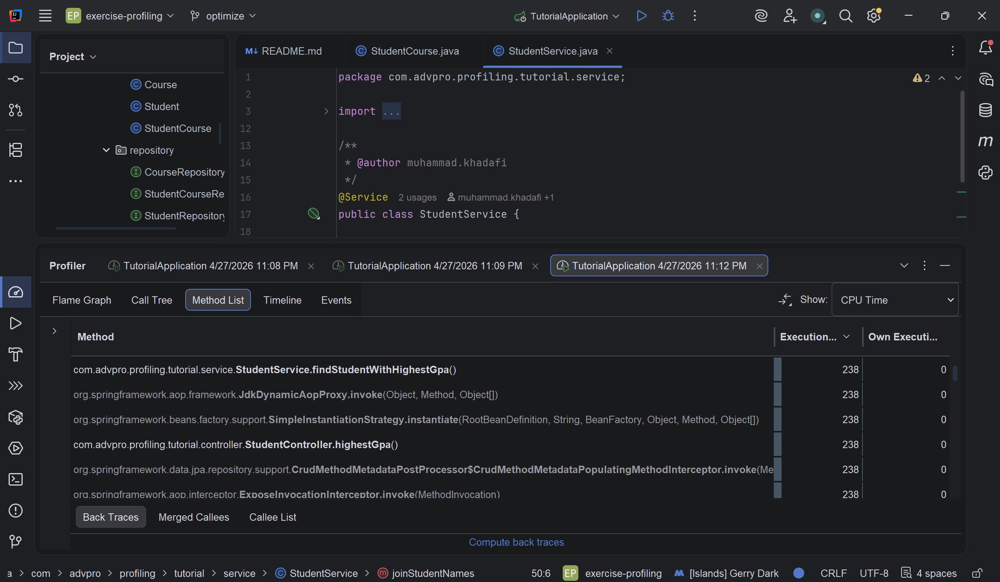
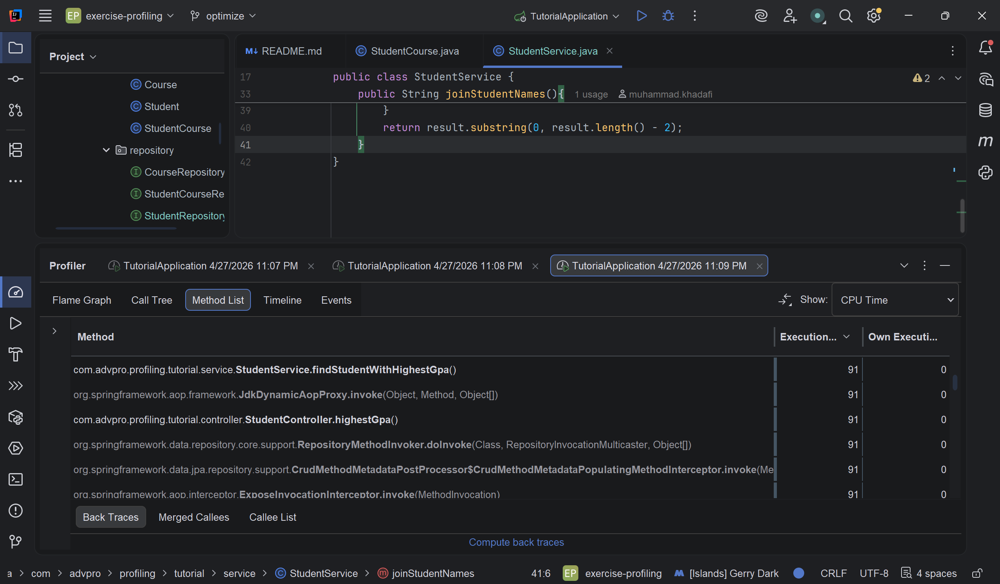

### Conclusion from JMeter after optimizing
Setelah melakukan profiling dan optimasi, saya melakukan performance test ulang dengan Jmeter untuk endpoint /all-student-name dan /highest-gpa, yang kemudian saya bandingkan lagi dengan hasil test Jmeter di awal sebelum optimasi.

Untuk endpoint /all-student-name, rata-rata response time sebelum optimasi adalah 1817 ms. Setelah dioptimasi, rata-rata response time turun menjadi 352 ms. Selain itu, throughput meningkat dari 4.0/sec menjadi 11.0/sec. Dari hasil ini, endpoint /all-student-name mengalami peningkatan performa yang jelas setelah optimasi.

Untuk endpoint /highest-gpa, rata-rata response time sebelum optimasi adalah 168 ms. Setelah optimasi, rata-rata response time turun menjadi 14 ms. Throughput juga meningkat dari 9.4/sec menjadi 10.9/sec. Dari hasil ini, endpoint /highest-gpa juga mengalami peningkatan performa yang jelas setelah optimasi.

Dari hasil tersebut, dapat disimpulkan bahwa optimasi yang dilakukan sangat meningkatkan performa dari kedua endpoint tersebut. Response time jadi jauh lebih rendah dan throughput meningkat.

## Reflection
1. Perbedaan utamanya adalah Jmeter melihat performa dari sisi pengguna atau client, seperti berapa lama response time sebuah endpoint, berapa throughtputnya, dan apakah ada request yang gagal. Sedangkan kalau Intellij Profiler melihat performa dari dalam aplikasi, terutama method mana yang paling banyak memakan CPU time. Intinya, JMeter membantu menunjukkan bahwa ada masalah performa, sedangkan Intellij Profiler membantu mencari bagian kode yang jadi penyebab masalah tersebut.

2. Profiling membantu saya mencari dan memahami bagian mana dari aplikasi yang paling berat dijalankan. Sebelum melakukan profiling, saya hanya bisa melihat bahwa endpoint tertentu terasa lambat dari hasil performance test. Setelah menggunakan profiler, saya bisa melihat method mana yang paling besar CPU timenya.
Dengan itu optimasi jadi lebih mudah dan jelas karena saya bisa langsung fokus memperbaiki bagian kode yang menjadi bottleneck.

3. Menurut saya IntelliJ Profiler cukup efektif untuk membantu mengidentifikasi bottleneck dalam aplikasi. Fitur seperti method list, call tree, dan flame graph memudahkan saya melihat alur pemanggilan method dan bagian mana yang paling banyak menggunakan waktu eksekusi. Dengan informasi tersebut, saya jadi bisa membedakan apakah masalah performa berasal dari logic di service, pemanggilan repository, query database, atau proses lain yang terjadi di dalam aplikasi.

4. Tantangan utama saat melakukan performance testing dan profiling adalah hasil pengukuran yang kadang tidak selalu konsisten, karena hasil bisa dipengaruhi oleh kondisi komputer, proses lain yang sedang berjalan, database, dan kondisi aplikasi saat pertama kali di-run. Run pertama juga bisa lebih lambat karena JVM masih melakukan warm-up. Jadi untuk mengatasinya, saya mencoba menjalankan test lebih dari sekali, memastikan aplikasi dan database sudah berjalan dengan benar, serta membandingkan hasil sebelum dan sesudah optimasi dengan kondisi yang semirip mungkin.

5. Manfaat utama dari IntelliJ Profiler adalah saya bisa melihat masalah performa secara lebih detail tanpa harus menambahkan banyak logging manual di kode. Profiler juga menunjukkan method mana yang paling lambat CPU time-nya, sehingga saya bisa fokus untuk optimasi pada bagian yang benar-benar berdampak. Ini membuat proses analisis performa menjadi lebih cepat dan mudah dengan data yang ada.

6. Kalau hasil IntelliJ Profiler dan JMeter tidak sepenuhnya sama, saya akan melihat keduanya dari konteks yang berbeda. JMeter menunjukkan performa request secara keseluruhan, sedangkan IntelliJ Profiler menunjukkan bagian internal kode yang paling berat. Jadi, saya perlu membandingkan keduanya, lalu menjalankan test ulang jika perlu untuk memastikan apakah perbedaannya memang karena perubahan kode atau hanya karena variasi saat pengukuran.

7. Strategi optimasi yang saya lakukan adalah memperbaiki bagian yang paling berat dari hasil profiling terlebih dahulu. Setelah itu, saya mengubah kode secara bertahap, seperti mengurangi proses yang tidak perlu, membuat query lebih efisien, dan mengganti operasi yang boros misalnya pada proses menggabungkan string. Setelah perubahan dilakukan, saya menjalankan ulang endpoint yang terdampak untuk memastikan hasilnya tetap benar, lalu membandingkan hasil sebelum dan sesudah optimasi melalui profiler dan JMeter.